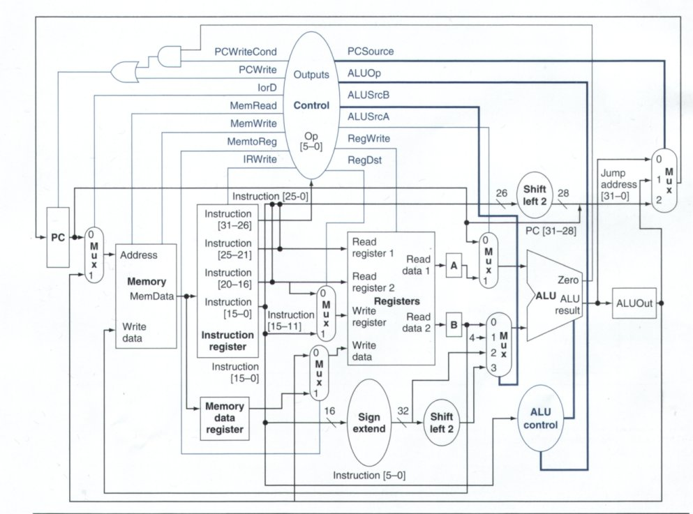

# mips-multiciclo

Verilog implementation of the MIPS multicycle shown in the following figure. It accepts the instructions **and**, **or**, **add**, **sub**, **slt**, **srlv**, **addi**, **lw** and **sw**. 

The control unit files are found under the [Controller](https://github.com/LeninSG21/mips-multiciclo/tree/main/Controller) section. The datapath are in the [Datapath](https://github.com/LeninSG21/mips-multiciclo/tree/main/Datapath) section. Finally, the top design is the [MIPS.sv](https://github.com/LeninSG21/mips-multiciclo/blob/main/MIPS.sv) file, and the testbench in the [MIPS_tb.sv](https://github.com/LeninSG21/mips-multiciclo/blob/main/MIPS_tb.sv). 

The assembly code is found in the [prueba.txt](https://github.com/LeninSG21/mips-multiciclo/tree/main/pruebaFuncionamiento/prueba.txt). The machine code was generated using the [mips-compiler](https://github.com/LeninSG21/mips-compiler) Python script. The testbench for the MIPS.sv was created with the [top-tb-generator](https://github.com/LeninSG21/top-tb-generator) and then populated with the instructions to perform.
